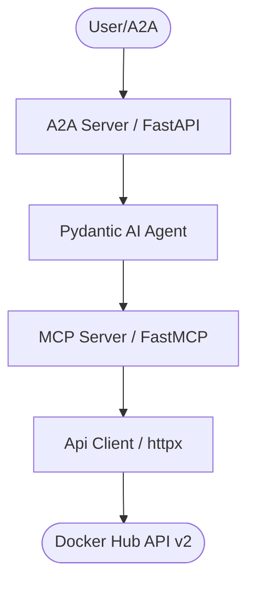
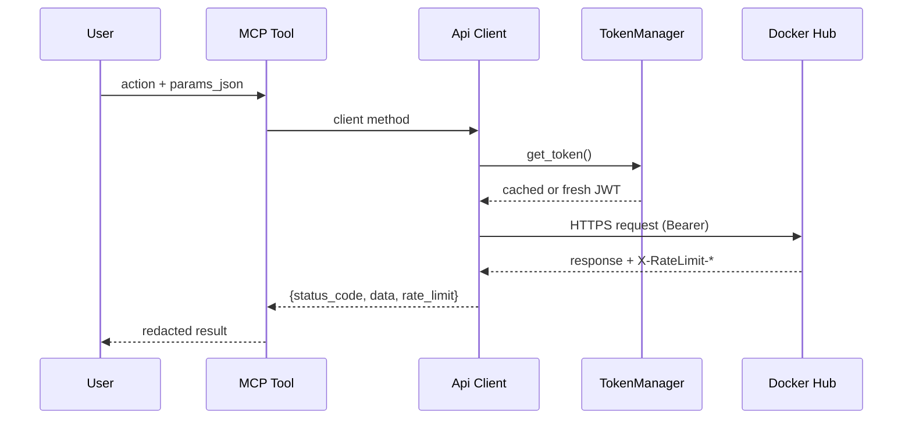

# AGENTS.md

> Claude Code loads this file via `CLAUDE.md` (`@AGENTS.md` import) — the two stay
> in sync. Edit **this** file, not `CLAUDE.md`.

## Tech Stack & Architecture
- Language/Version: Python 3.11+
- Core Libraries: `agent-utilities`, `httpx`, `fastmcp`, `pydantic-ai`
- Key principles: raw `httpx` client, Pydantic input/response models, action-routed
  MCP tools, asynchronous tool execution.
- Architecture:
    - `dockerhub_api/api/` — per-domain client mixins over `DockerHubApiBase`
      (transport, JWT auth, rate-limit capture, 429 backoff, destructive gating).
    - `dockerhub_api/auth.py` — `TokenManager` (JWT mint/cache/refresh) + `get_client`.
    - `dockerhub_api/mcp/` — one action-routed tool module per domain.
    - `dockerhub_api/mcp_server.py` — MCP server entry point and tool registration.
    - `dockerhub_api/agent_server.py` — Pydantic AI A2A agent server.

### Architecture Diagram


### Workflow Diagram


## Commands (run these exactly)
```bash
# Installation
pip install .[all]

# Quality & Linting (run from project root)
pre-commit run --all-files

# Tests
python -m pytest tests -q

# Execution entry points
dockerhub-mcp      # dockerhub_api.mcp_server:mcp_server
dockerhub-agent    # dockerhub_api.agent_server:agent_server
```

## Project Structure Quick Reference
- MCP Entry Point → `dockerhub_api/mcp_server.py`
- Agent Entry Point → `dockerhub_api/agent_server.py`
- API Client → `dockerhub_api/api_client.py` + `dockerhub_api/api/`
- Auth lifecycle → `dockerhub_api/auth.py`
- Models → `dockerhub_api/dockerhub_input_models.py`, `dockerhub_api/dockerhub_response_models.py`
- Tests → `tests/` (mocked `httpx.MockTransport`; never call the live Docker Hub)

## Code Style & Conventions
**Always:**
- Use `agent-utilities` for common patterns (`create_mcp_server`, `create_agent_server`).
- Define input/output models using Pydantic; input models build `api_parameters`/`payload`
  in `model_post_init`.
- Include descriptive docstrings for all tools (they are used as tool descriptions for LLMs).
- Return the uniform `{status_code, data, rate_limit}` envelope from client methods.
- Gate destructive operations through `DockerHubApiBase._guard_destructive`.
- Redact secrets in MCP results (`dockerhub_api.mcp.redact_secrets`); plaintext tokens
  may appear exactly once, on creation.

## Dos and Don'ts
**Do:**
- Run `pre-commit` before pushing changes.
- Keep tools focused and idempotent where possible.
- Use the `CONCEPT:HUB-1.x` markers when adding capabilities (registry in `docs/concepts.md`).

**Don't:**
- Use `cd` commands in scripts; use absolute paths or paths relative to project root.
- Add new dependencies to `dependencies` in `pyproject.toml` without checking
  `optional-dependencies` first.
- Hardcode secrets; use environment variables or `.env` files.
- Make live Docker Hub calls in tests — extend `tests/conftest.py::MockHub` instead.

## Safety & Boundaries
**Always do:**
- Run lint/test via `pre-commit`.
- Keep deletes and org-settings writes behind `allow_destructive`.

**Ask first:**
- Major refactors of `mcp_server.py` or `agent_server.py`.
- Deleting or renaming public tool functions or client methods.

**Never do:**
- Commit `.env` files or secrets.
- Modify `agent-utilities` or `universal-skills` files from within this package.

## When Stuck
- Propose a plan first before making large changes.
- Check `agent-utilities` documentation for existing helpers.
- The structural sibling is `agents/gitlab-api` — follow its patterns.

## ⛔ Keep the Repository Root Pristine — No Scratch / Temp / Debug Files

**The repository ROOT must contain only canonical project files** (packaging,
config, docs, lockfiles). The only hidden directories allowed at root are
`.git/`, `.github/`, and `.specify/` (plus a local, git-ignored `.venv/`).

**NEVER write any of the following — anywhere in the repo, and ESPECIALLY at the root:**
- One-off / debug / migration scripts: `fix_*.py`, `migrate_*.py`, `debug_*.py`,
  or `test_*.py` **at the root** (real tests live in `tests/` only).
- Databases / data dumps: `*.db`, `*.sqlite*`; logs / command output: `*.log`,
  scratch `*.txt`, `*.orig`, `*.rej`, `*.bak`.
- Build artifacts and per-tool caches committed to git.

**Where scratch goes instead:** `~/workspace/scratch/` (experiments),
`~/workspace/reports/` (command output); tests go in `tests/` (pytest).
Before finishing a task, run `git status` and confirm no stray root files were added.

## Working Discipline — think, simplify, stay surgical, verify

- **Think before coding.** State your assumptions explicitly. If a request has more
  than one reasonable reading, surface the options instead of silently picking one.
- **Simplicity first.** Write the minimum code that solves the stated problem — no
  speculative features, no abstraction for single-use code. (Name code from its
  purpose, never `wave0`/`phase2`/`v2`.)
- **Stay surgical.** Every changed line should trace directly to the task. Don't
  refactor or reformat working code adjacent to your change. *Exception — the
  Quality Bar below:* lint/format/type errors the pre-commit gate flags get fixed
  regardless of who introduced them.
- **Verify against a goal.** Turn the task into a checkable outcome before you
  start; loop until the checks pass.

## Quality Bar — Leave the Codebase Clean (REQUIRED)

After completing any code change, run the project's pre-commit suite and drive it
**fully green** before committing:

```bash
pre-commit run --all-files
```

Resolve **every** issue it reports — failures, lint errors, type errors, and
warnings — **including problems that pre-date your change**. Do not silence checks
(`# noqa`, `# type: ignore`, `SKIP=`, `--no-verify`) to force green unless the
exception is already documented here. Only commit once `pre-commit run
--all-files` passes cleanly.

## Working with Git Worktrees (multi-session)

Multiple agents/sessions work the `agent-packages/*` repos concurrently. **Do not
edit the canonical checkout** (`/home/apps/workspace/agent-packages/agents/<repo>`)
— take your own git worktree on your own branch instead:

```bash
rm_worktree add <repo> <your-branch>      # -> /home/apps/worktrees/<repo>/<your-branch>
```

Work in the worktree and **commit often**. Each session must use a **distinct
branch**. Finishing work: (1) `pre-commit run --all-files` green, (2) commit,
(3) merge to main locally (`rm_worktree merge` or `git merge --no-ff`), pushing
only when the user asks, (4) remove the worktree and delete the merged branch.

<!-- BEGIN concept-coordination (generated) -->
## Concept-ID Coordination (multi-session)

Working in parallel with other sessions/worktrees? **Reserve a concept id before you write its `CONCEPT:` marker** so two sessions never collide:

```bash
agent-utilities --json concept reserve --ns KG-2   # or a package prefix, e.g. KEY
```

Full protocol (ledger, merge=union, reconcile, MCP/REST): <https://knuckles-team.github.io/agent-utilities/concept_coordination/>
<!-- END concept-coordination (generated) -->
