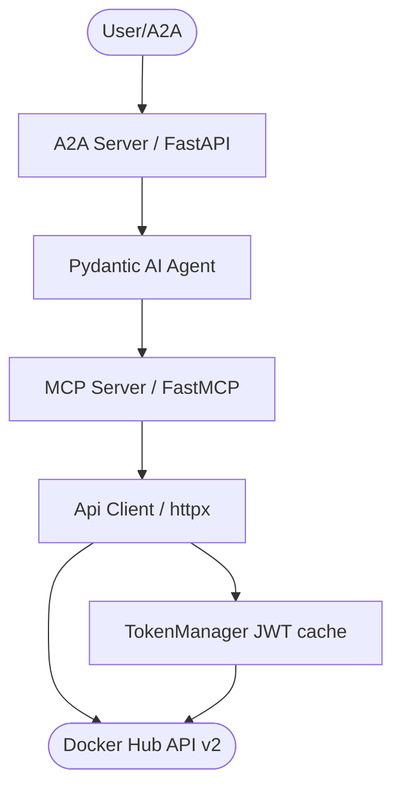

# Overview

`dockerhub-api` ships three layers over the official **Docker Hub API v2**
(`https://hub.docker.com`, OpenAPI "Docker HUB API v2-beta"):

1. **API client** — `dockerhub_api.api_client.Api`, a raw `httpx` client composed
   from per-domain mixins.
2. **MCP server** — `dockerhub-mcp`, exposing seven consolidated, action-routed
   tools.
3. **A2A agent server** — `dockerhub-agent`, a Pydantic-AI graph agent over the
   MCP tool surface.

## Architecture



Every client method returns a uniform envelope:

```json
{"status_code": 200, "data": {...}, "rate_limit": {"limit": 180, "remaining": 179, "reset": 1765400000}}
```

## Endpoint coverage

| Spec group | Endpoints | Client methods |
|---|---|---|
| Auth | `POST /v2/auth/token`, `POST /v2/users/login` (deprecated), `POST /v2/users/2fa-login` | `create_auth_token`, `login`, `two_factor_login` |
| Personal access tokens | `GET/POST /v2/access-tokens`, `GET/PATCH/DELETE /v2/access-tokens/{uuid}` | `get_access_tokens`, `create_access_token`, `get_access_token`, `update_access_token`, `delete_access_token` |
| Org access tokens | `GET/POST /v2/orgs/{org}/access-tokens`, `GET/PATCH/DELETE /v2/orgs/{org}/access-tokens/{id}` | `get_org_access_tokens`, `create_org_access_token`, `get_org_access_token`, `update_org_access_token`, `delete_org_access_token` |
| Audit logs | `GET /v2/auditlogs/{account}`, `GET /v2/auditlogs/{account}/actions` | `get_audit_logs`, `get_audit_log_actions` |
| Org settings | `GET/PUT /v2/orgs/{name}/settings` | `get_org_settings`, `update_org_settings` |
| Repositories | `GET/POST /v2/namespaces/{ns}/repositories`, `GET/HEAD .../{repo}`, `GET/HEAD .../tags(/{tag})`, `PATCH .../immutabletags`, `POST .../immutabletags/verify`, `POST /v2/repositories/{ns}/{repo}/groups` | `get_repositories`, `create_repository`, `get_repository`, `check_repository`, `get_repository_tags`, `check_repository_tags`, `get_repository_tag`, `check_repository_tag`, `update_immutable_tags`, `verify_immutable_tags`, `assign_repository_group` |
| Org members | `GET /v2/orgs/{org}/members(/export)`, `PUT/DELETE /v2/orgs/{org}/members/{username}` | `get_org_members`, `export_org_members`, `update_org_member`, `remove_org_member` |
| Invites | `GET /v2/orgs/{org}/invites`, `DELETE /v2/invites/{id}`, `PATCH /v2/invites/{id}/resend`, `POST /v2/invites/bulk` | `get_org_invites`, `delete_invite`, `resend_invite`, `bulk_invite` |
| Groups (teams) | `GET/POST /v2/orgs/{org}/groups`, `GET/PUT/PATCH/DELETE .../{group}`, `GET/POST .../members`, `DELETE .../members/{username}` | `get_groups`, `create_group`, `get_group`, `update_group`, `patch_group`, `delete_group`, `get_group_members`, `add_group_member`, `remove_group_member` |
| SCIM 2.0 | `GET ServiceProviderConfig / ResourceTypes(/{name}) / Schemas(/{id})`, `GET/POST Users`, `GET/PUT Users/{id}` | `get_scim_service_provider_config`, `get_scim_resource_types`, `get_scim_resource_type`, `get_scim_schemas`, `get_scim_schema`, `get_scim_users`, `create_scim_user`, `get_scim_user`, `replace_scim_user` |
| Diagnostics | rate-limit headers, JWT introspection (local) | `get_rate_limit`, `whoami` |

## The action-routed MCP surface

Each tool takes an `action` plus a `params_json` JSON object; one tool covers an
entire domain. Modules are individually togglable with `*TOOL` environment flags.

| Tool | Actions |
|---|---|
| `hub_auth` | `create_token`, `login`, `two_factor_login`, `list_pats`, `create_pat`, `get_pat`, `update_pat`, `delete_pat`, `list_oats`, `create_oat`, `get_oat`, `update_oat`, `delete_oat` |
| `hub_repos` | `list`, `create`, `get`, `check`, `list_tags`, `check_tags`, `get_tag`, `check_tag`, `set_immutable_tags`, `verify_immutable_tags`, `assign_group` |
| `hub_org` | `get_settings`, `update_settings`, `list_members`, `export_members`, `update_member`, `remove_member`, `list_invites`, `delete_invite`, `resend_invite`, `bulk_invite` |
| `hub_teams` | `list`, `create`, `get`, `update`, `patch`, `delete`, `list_members`, `add_member`, `remove_member` |
| `hub_audit` | `logs`, `actions` |
| `hub_scim` | `service_provider_config`, `resource_types`, `resource_type`, `schemas`, `schema`, `list_users`, `get_user`, `create_user`, `update_user` |
| `hub_admin` | `rate_limit`, `whoami` |

## Safety model

- **Destructive gating** — deletes (tokens, groups, members, invites) and
  org-settings writes raise `DestructiveOperationError` unless
  `DOCKERHUB_ALLOW_DESTRUCTIVE=True`. Repository creation is allowed by default —
  it is the primary provisioning use case (creating image repos for releases).
- **Secret redaction** — JWTs, passwords, and refresh tokens are masked in every
  tool result; the plaintext PAT/OAT value appears exactly once, on creation.
- **Rate limiting** — `X-RateLimit-Limit/-Remaining/-Reset` are captured on every
  response; HTTP 429 is retried with a bounded `Retry-After` backoff (cap 15 s,
  3 retries by default).
